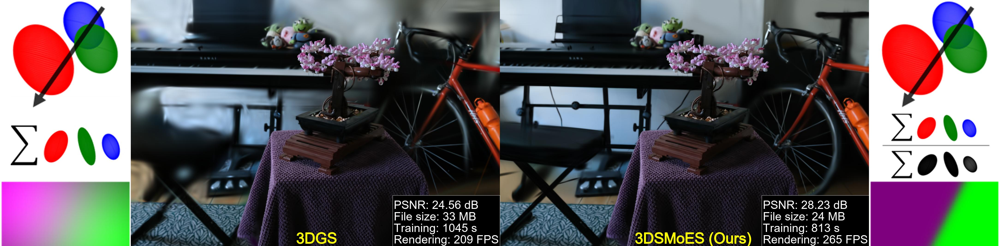

# 3D SMoE Splatting for Edge-aware Realtime Radiance Field Rendering

[Project page](https://yihsinli.github.io/3D-SMoE-Splatting/) | [Paper](coming soon) | [Video](coming soon) | <br>



This repository provides the official implementation of the paper “3D SMoE Splatting for Edge-aware Realtime Radiance Field Rendering.” The method represents a scene using a set of Gaussian density functions and incorporates compression and densification techniques to improve compactness and efficiency.


## Installation

```bash
# download
git clone https://github.com/yihsinli/3d-SMoE-Splatting.git --recursive

# if you have an environment used for 3dgs, use it
# if not, create a new environment
conda env create --file environment.yml
conda activate 3dsmoesplatting
```
## Training and Testing
To train a scene, simply use
```bash
python train.py -s <path to COLMAP or NeRF Synthetic dataset> -m <path to output folder> --init_path default
```
Commandline arguments for regularizations
```bash
--eval  # evaluation mode or not
--densify_until_iter # iterations for add/remove Gaussians, default = 15000 
--densify_grad_threshold # Grad threshold for densification, default = 0.0002
```
**Tips for adjusting the parameters on your own dataset:**
- For compact representation, we suggest using higher threshold, i.e., ``densify_grad_threshold=0.05``,  for low-rate regime.
The testing results will be automatically generated in the same folder under 'test' and 'all_results' folders

## Rendering
### Navigation pose generator
To export a camera pose for rendering video, simply use
```bash
python generate_pose.py -s <path to COLMAP dataset> --m <path to pre-trained model> --iteration 30000
```
To export a rendered result (video), simply use
```bash
python render.py -m <path to pre-trained model> -s <path to COLMAP dataset> --iteration 30000
```
Commandline arguments you should adjust accordingly for meshing for bounded TSDF fusion, use
```bash

## Quick Examples
Assuming you have downloaded [MipNeRF360](https://jonbarron.info/mipnerf360/), simply use
```bash
python train.py -s <path to m360>/<counter> -m SMoEoutput/m360/counter
# use our pose generator
python generate_pose.py -s <path to m360>/<counter> -m SMoEoutput/m360/counter --iteration 30000
# or use the bounded mesh extraction if you focus on foreground
python render.py -s <path to m360>/<counter> -m output/m360/counter --iteration 30000
```

**Custom Dataset**: We use the same COLMAP loader as 3DGS, you can prepare your data following [here](https://github.com/graphdeco-inria/gaussian-splatting?tab=readme-ov-file#processing-your-own-scenes). 


## Acknowledgements
This project is built upon [3DGS](https://github.com/graphdeco-inria/gaussian-splatting). We thank all the authors for their great repos. 


## Citation
If you find our code or paper helps, please consider citing:
```bibtex
@inproceedings{Li3DSMoE2025,
    title={3D SMoE Splatting for Edge-aware Realtime Radiance Field Rendering},
    author={Li, Yi-Hsin and Sikora, Thomas and Knorr, Sebastian and Sjöström, Mårten},
    publisher = {Association for Computing Machinery},
    booktitle = {SIGGRAPH Asia 2025 Conference Papers},
    year      = {2025}
}
```
